## visclass_f19_a02_report

#### 数据描述和分析：

- 选取的数据源为[GLEISER,DANON--COLLABORATION IN JAZZ](http://moreno.ss.uci.edu/data.html#jazz)
  - [198×198 symmetric binary matrix ](http://moreno.ss.uci.edu/jazz.dat)这个数据记录了爵士乐队的网络。数据包括了1912年至1940年之间演出的198个乐队，其中大多数乐队都是在20世纪20年代演出的。每个顶点对应一个乐队，如果两个乐队至少有一个共同的音乐家，则两个乐队之间将建立链接。
- 数据源为198 * 198 的binary-matrix，对数据进行初步的分析，展示热力图：
  - 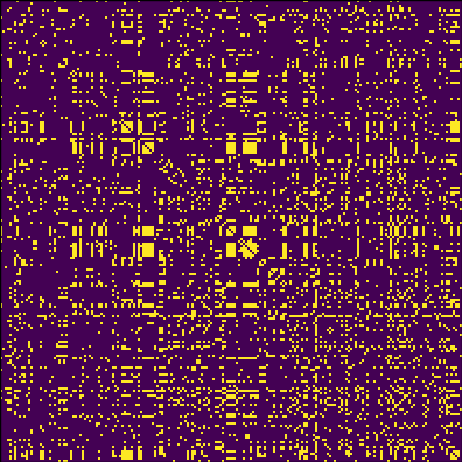
  - 可以观察到，数据**较为稀疏**，且为**无向图**，共存在**198个node**，**2742个link**
  - 数据**可能存在聚类关系**
  - 因此，**对数据的分析包括**
    - 利用**矩阵可视化方法**观察 **频率**、**聚类**等信息，对数据**整体**进行分析
    - 利用**力导向图**进行**图的细节展示**，并尝试进行不同参数下的**聚类分析**
    - 利用**矩阵可视化和力导向图之间的交互**来分析**两种方法在聚类分析等问题上的关系**，并综合两者优点，对数据进行**全面展示**

#### 设计介绍：

综合分析了数据特性后，我选择了两个维度对数据进行可视化，并通过**交互**将其联系起来

- **力导向图**

  - 力导向图支持不同参数的调整

    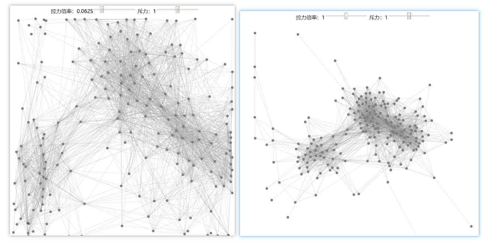

  - 利用交互方式使得我们可以对特定点进行分析，当放在一个node上时，其会突出显示与该点相连的边和点

    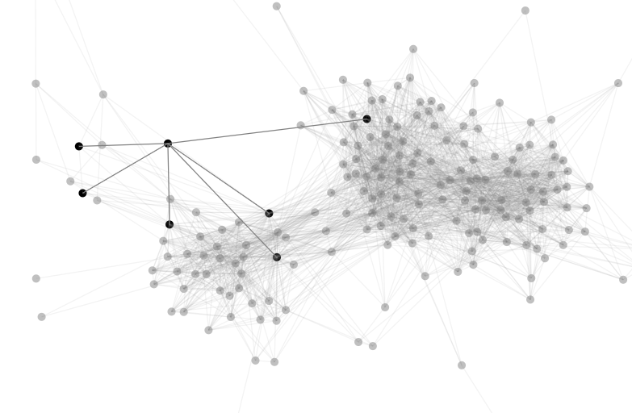

    

  - 支持拖拽点，对生成的结果进行调整

    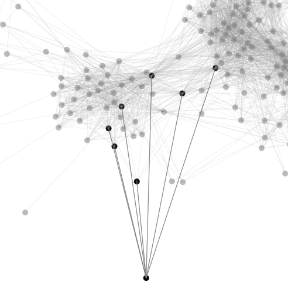

- **矩阵可视化**

  - 矩阵选择了三种排序方式：name、frequency、cluster，分别可展示原图、按连接边数、按聚类的矩阵

    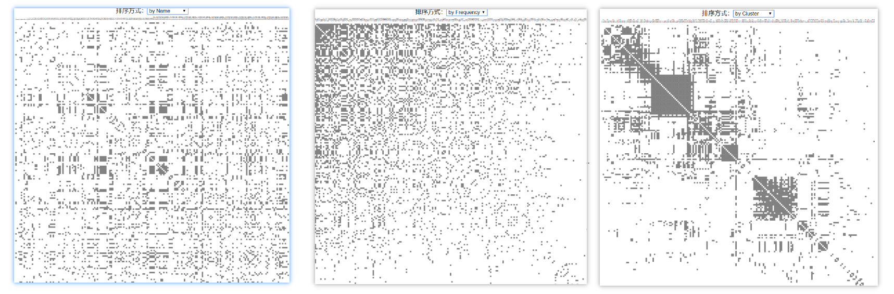

  - 运用交互手段，我们可以方便查看不同点在不同展示图下的分布

    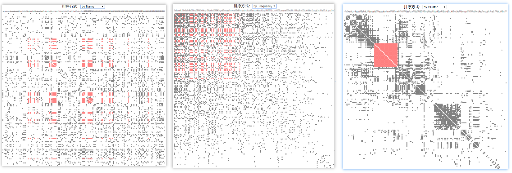

  - 变化过程动态展现，也可以一定程度上反映变化细节

- **交互**

  - 通过**交互**将**力导向图和矩阵可视化联系起来**，我们可以对比矩阵可视化下的聚类情况和力导向图下的聚类情况，方便分析两种方法的相同点

    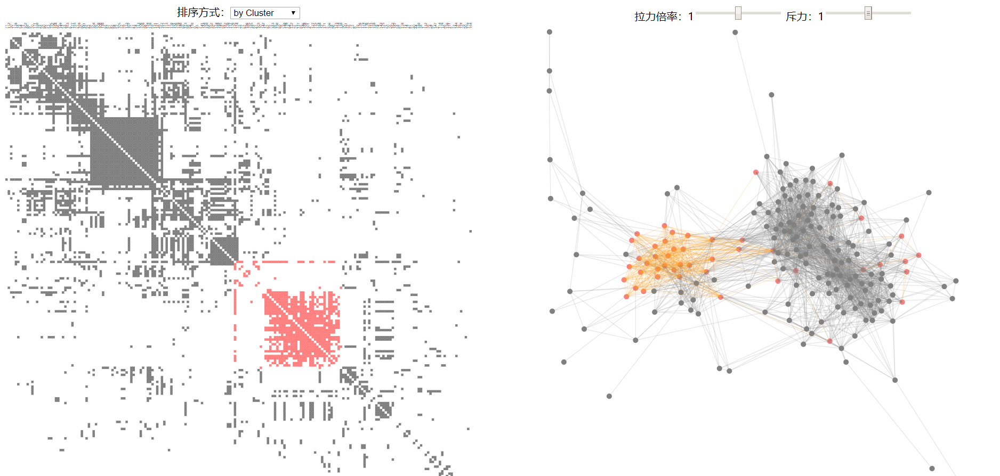

  - 我们也可以分析**力导向图**对frequency这一要素的展示程度

    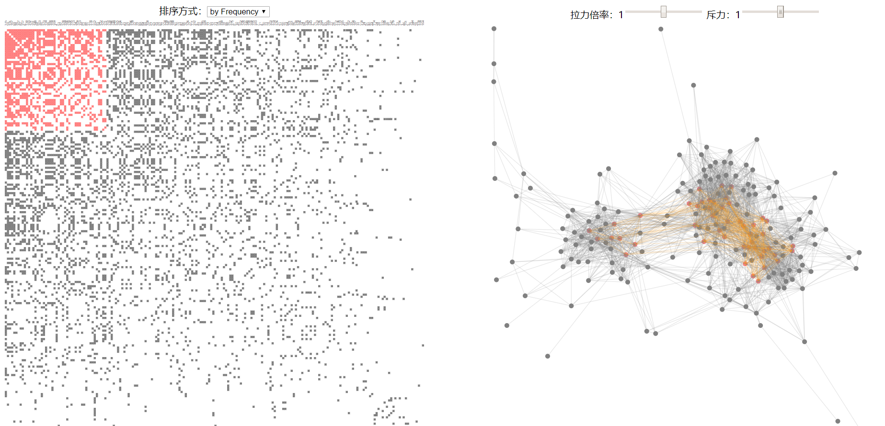

#### 设计宗旨

- 选择这些数据分析的原因：
  - 最大程度保留原图信息，力求从宏观（矩阵可视化）和微观（力导向图）来对数据进行展示
  - 关注不同数据间的关系，因此选择可以展现聚类关系的可视化方式，因而未选择边绑定方法
  - 关注矩阵可视化和力导向图之间的联系，不同可视化方法得到的聚类应该大体上殊途同归
- 设计的好处
  - 可以从宏观和微观展现数据
  - 充分考虑交互性，方便使用者自行对数据进行探索
  - 比较了两种方法，在展示原数据的基础上，还追加分析了不同可视化方法的异同
  - layout简练清晰，方便使用
  - 可控制参数多，方便个性化分析
- 设计的缺点
  - 计算量大，由于是两种可视化方法共同运行，因此对资源的要求较高，容易出现卡顿
  - 计算较慢导致可视化效果不甚流畅
- 设计的难点
  - 交互性设计，包括力导向图、矩阵可视化内部的交互，也包括两个方法之间的交互
  - 动画设计
  - 异步并行设计，由于js的特殊性，异步处理是一个比较重要的问题

#### 可视化结果描述

- 作品介绍可以参看上面的内容：**设计介绍**，该部分对设计思路进行了详细介绍和展示

- 发现：

  - **矩阵可视化方法和力导向图都可以在一定程度上展示聚类**，可以看到整体上**数据大致分为两个大部分**，两种方法都可以体现出来：

    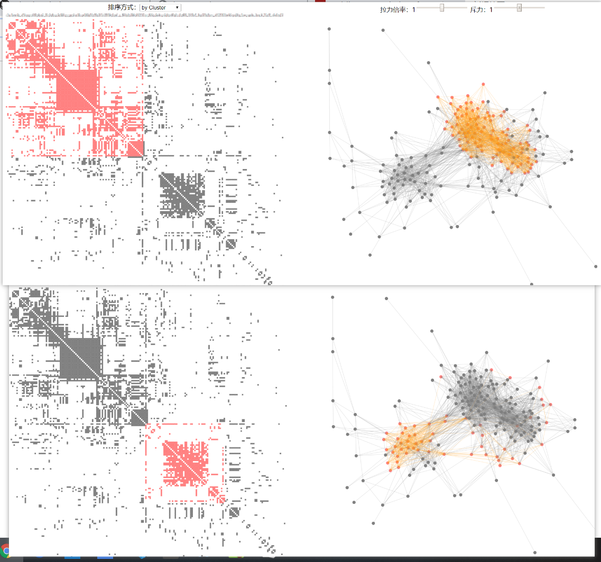

  - **力导向图对于聚类的整体展示更清晰些**，我们也可以看到**一些孤立点**的存在

  - **矩阵可视化方法对于小聚类的展示更清晰**，我们可以看到在矩阵中出现了一些**完全子图**，这一点也可以通过交互在力导向图中展示出来

    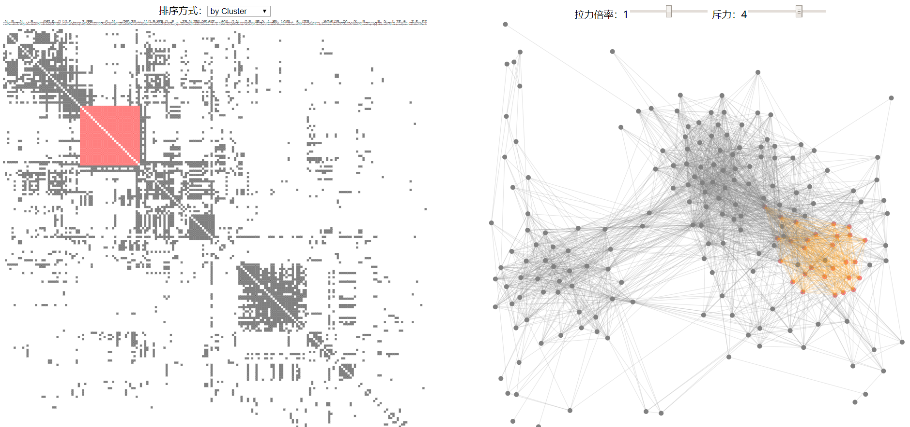

  - 通过矩阵可视化的frequency排序，我们可以看到整个数据是**较为稀疏的**，其中**出度最大（即所连边数最多）的点基本位于力导向图的中心**，也与直觉基本一致

    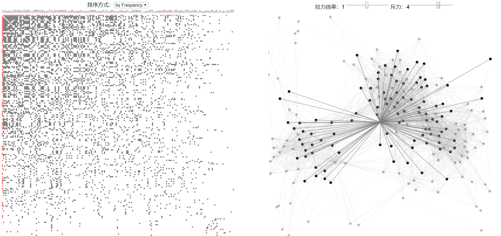

  - 整个过程的感受：

    - 融入交互手段后，我们可以灵活比较不同的数据展现方式，得到一些平常方法难以挖掘到的信息
    - 在对关系图进行分析时，力导向图和矩阵可视化均是很好的可视化手段